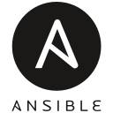
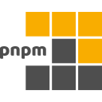

<h1 align="center">Hi 👋, I'm Mohammad Abu Mattar</h1>
<h3 align="center">Software Engineer | AWS Cloud Engineer</h3>

  <a href="https://mkabumattar.com/">💻 My Portfolio</a> | 
  <a href="https://mkabumattar.com/blog">✍️ My Blog</a> | 
  <a href="mailto:info@mkabumattar.com">📫 Contact Me</a> | 
  <a href="https://mkabumattar.com/assets/pdf/mohammad_abu_mattar_cv.pdf">📄 My Resume</a>

---

<h2 align="left">👨‍💻 Introduction</h2>

I'm Mohammad Abu Mattar, a passionate Software Engineer with a focus on cloud technologies, particularly AWS. In this profile, you'll find details about my skills, projects, and certifications that reflect my expertise and experience.

<h2 align="left">📕 Latest Blog Posts</h2>

<!-- BLOG-POST-LIST:START -->
- [AI is Not Real: A Software Engineering Perspective](https://mkabumattar.com/blog/post/ai-is-not-real/)
- [When to Use Serverless?](https://mkabumattar.com/blog/post/when-to-use-serverless/)
- [Why You Should Not Use Else Statements in Your Code](https://mkabumattar.com/blog/post/why-you-should-not-use-else-statements/)
- [How to Avoid Over-Engineering Your Code?](https://mkabumattar.com/blog/post/how-to-avoid-over-engineering-your-code/)
<!-- BLOG-POST-LIST:END -->

<h2 align="left">🔗 Connect with Me:</h2>

  <a href="https://linkedin.com/in/mkabumattar" target="blank">
    <picture>
      <source media="(prefers-color-scheme: dark)" srcset="./assets/linkedin.svg">
      
    </picture>
  </a>
  <a href="https://codepen.io/mkabumattar" target="blank">
    <picture>
      <source media="(prefers-color-scheme: dark)" srcset="./assets/codepen-dark.svg">
      
    </picture>
  </a>
  <a href="https://mkabumattar.com/rss.xml" target="blank">
    <picture>
      <source media="(prefers-color-scheme: dark)" srcset="./assets/rss.svg">
      
    </picture>
  </a>
  <a href="https://instagram.com/mkabumattar" target="blank">
    <picture>
      <source media="(prefers-color-scheme: dark)" srcset="./assets/instagram.svg">
      
    </picture>
  </a>
  <a href="https://twitter.com/mkabumattar" target="blank">
    <picture>
      <source media="(prefers-color-scheme: dark)" srcset="./assets/twitter-dark.svg">
      
    </picture>
  </a>
  <a href="https://fb.com/mkabumattar" target="blank">
    <picture>
      <source media="(prefers-color-scheme: dark)" srcset="./assets/facebook.svg">
      
    </picture>
  </a>

<h2 align="left">🛠️ Skills</h2>

<h3 align="left">Programming Languages:</h3>

  <picture>
    <source media="(prefers-color-scheme: dark)" srcset="./assets/java.svg">
    
  </picture>
  <picture>
    <source media="(prefers-color-scheme: dark)" srcset="./assets/javascript.svg">
    
  </picture>
  <picture>
    <source media="(prefers-color-scheme: dark)" srcset="./assets/python.svg">
    
  </picture>
  <picture>
    <source media="(prefers-color-scheme: dark)" srcset="./assets/typescript.svg">
    
  </picture>

<h3 align="left">Web Development</h3>

<h4 align="left">Frontend:</h4>

  <picture>
    <source media="(prefers-color-scheme: dark)" srcset="./assets/css3-dark.svg">
    
  </picture>
  <picture>
    <source media="(prefers-color-scheme: dark)" srcset="./assets/html5-dark.svg">
    
  </picture>
  <picture>
    <source media="(prefers-color-scheme: dark)" srcset="./assets/sass.svg">
    
  </picture>
  <picture>
    <source media="(prefers-color-scheme: dark)" srcset="./assets/tailwindcss-dark.svg">
    
  </picture>

<h4 align="left">Backend:</h4>

  <picture>
    <source media="(prefers-color-scheme: dark)" srcset="./assets/nodejs-dark.svg">
    
  </picture>
  <picture>
    <source media="(prefers-color-scheme: dark)" srcset="./assets/express-dark.svg">
    
  </picture>
  <picture>
    <source media="(prefers-color-scheme: dark)" srcset="./assets/fastapi.svg">
    
  </picture>
  <picture>
    <source media="(prefers-color-scheme: dark)" srcset="./assets/spring.svg">
    
  </picture>

<h4 align="left">Frameworks & Libraries:</h4>

  <picture>
    <source media="(prefers-color-scheme: dark)" srcset="./assets/axios.svg">
    
  </picture>
  <picture>
    <source media="(prefers-color-scheme: dark)" srcset="./assets/astro-dark.svg">
    
  </picture>
  <picture>
    <source media="(prefers-color-scheme: dark)" srcset="./assets/nextjs-dark.svg">
    
  </picture>
  <picture>
    <source media="(prefers-color-scheme: dark)" srcset="./assets/react.svg">
    
  </picture>

<h3 align="left">Database:</h3>

  <picture>
    <source media="(prefers-color-scheme: dark)" srcset="./assets/dynamodb.svg">
    
  </picture>
  <picture>
    <source media="(prefers-color-scheme: dark)" srcset="./assets/mariadb-dark.svg">
    
  </picture>
  <picture>
    <source media="(prefers-color-scheme: dark)" srcset="./assets/mongodb-dark.svg">
    
  </picture>
  <picture>
    <source media="(prefers-color-scheme: dark)" srcset="./assets/mysql-dark.svg">
    
  </picture>
  <picture>
    <source media="(prefers-color-scheme: dark)" srcset="./assets/postgresql-dark.svg">
    
  </picture>
  <picture>
    <source media="(prefers-color-scheme: dark)" srcset="./assets/redis-dark.svg">
    
  </picture>

<h3 align="left">Cloud & DevOps:</h3>

  <picture>
    <source media="(prefers-color-scheme: dark)" srcset="./assets/aws-dark.svg">
    
  </picture>
  <picture>
    <source media="(prefers-color-scheme: dark)" srcset="./assets/ansible-dark.svg">
    
  </picture>
  <picture>
    <source media="(prefers-color-scheme: dark)" srcset="./assets/docker-dark.svg">
    
  </picture>
  <picture>
    <source media="(prefers-color-scheme: dark)" srcset="./assets/jenkins-dark.svg">
    
  </picture>
  <picture>
    <source media="(prefers-color-scheme: dark)" srcset="./assets/terraform-dark.svg">
    
  </picture>
  <picture>
    <source media="(prefers-color-scheme: dark)" srcset="./assets/terragrunt-dark.svg">
    
  </picture>

<h3 align="left">Version Control:</h3>

  <picture>
    <source media="(prefers-color-scheme: dark)" srcset="./assets/git-dark.svg">
    
  </picture>
  <picture>
    <source media="(prefers-color-scheme: dark)" srcset="./assets/bitbucket-dark.svg">
    
  </picture>
  <picture>
    <source media="(prefers-color-scheme: dark)" srcset="./assets/github-dark.svg">
    
  </picture>
  <picture>
    <source media="(prefers-color-scheme: dark)" srcset="./assets/gitlab-dark.svg">
    
  </picture>

<h3 align="left">Servers:</h3>

  <picture>
    <source media="(prefers-color-scheme: dark)" srcset="./assets/apache.svg">
    
  </picture>
  <picture>
    <source media="(prefers-color-scheme: dark)" srcset="./assets/nginx.svg">
    
  </picture>

<h3 align="left">Tools:</h3>

  <picture>
    <source media="(prefers-color-scheme: dark)" srcset="./assets/bash-dark.svg">
    
  </picture>
  <picture>
    <source media="(prefers-color-scheme: dark)" srcset="./assets/jetbrains.svg">
    
  </picture>
  <picture>
    <source media="(prefers-color-scheme: dark)" srcset="./assets/npm.svg">
    
  </picture>
  <picture>
    <source media="(prefers-color-scheme: dark)" srcset="./assets/pnpm-dark.svg">
    
  </picture>
  <picture>
    <source media="(prefers-color-scheme: dark)" srcset="./assets/poetry.svg">
    
  </picture>
  <picture>
    <source media="(prefers-color-scheme: dark)" srcset="./assets/postman.svg">
    
  </picture>
  <picture>
    <source media="(prefers-color-scheme: dark)" srcset="./assets/powershell.svg">
    
  </picture>
  <picture>
    <source media="(prefers-color-scheme: dark)" srcset="./assets/ssh-dark.svg">
    
  </picture>
  <picture>
    <source media="(prefers-color-scheme: dark)" srcset="./assets/swagger-dark.svg">
    
  </picture>
  <picture>
    <source media="(prefers-color-scheme: dark)" srcset="./assets/vim.svg">
    
  </picture>
  <picture>
    <source media="(prefers-color-scheme: dark)" srcset="./assets/vscode.svg">
    
  </picture>
  <picture>
    <source media="(prefers-color-scheme: dark)" srcset="./assets/yarn.svg">
    
  </picture>

<h3 align="left">Operating System:</h3>

  <picture>
    <source media="(prefers-color-scheme: dark)" srcset="./assets/linux.svg">
    
  </picture>
  <picture>
    <source media="(prefers-color-scheme: dark)" srcset="./assets/debian-dark.svg">
    
  </picture>
  <picture>
    <source media="(prefers-color-scheme: dark)" srcset="./assets/ubuntu-dark.svg">
    
  </picture>
  <picture>
    <source media="(prefers-color-scheme: dark)" srcset="./assets/windows.svg">
    
  </picture>

<h2 align="left">📜 Certifications:</h2>

  <picture>
    <source media="(prefers-color-scheme: dark)" srcset="./assets/aws-certified-developer-associate.png">
    
  </picture>
  <picture>
    <source media="(prefers-color-scheme: dark)" srcset="./assets/aws-certified-cloud-practitioner.png">
    
  </picture>

  <a href="https://www.credly.com/users/mkabumattar/badges" target="_blank">
    Check all certifications
  </a>

 

<h2 align="left">📊 GitHub Stats </h2>

&nbsp;

