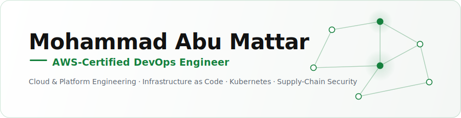
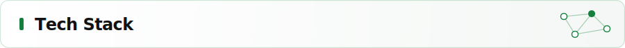
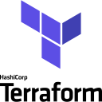
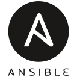
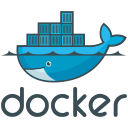
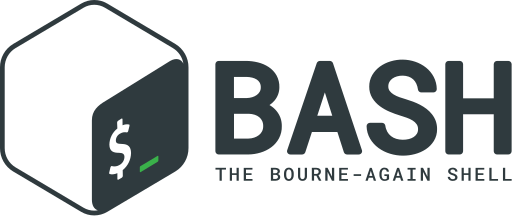
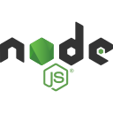
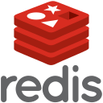
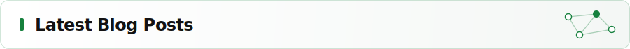
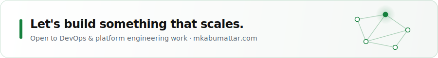

<a href="https://mkabumattar.com/" target="_blank">
<picture>
  <source media="(prefers-color-scheme: dark)" srcset="./.github/assets/img/banner-dark.svg" />
  
</picture>
</a>

# Mohammad Abu Mattar

**AWS-Certified DevOps Engineer** · Cloud, Platform & Reliability · Amman, Jordan

---

DevOps engineer, 6+ years building high-scale cloud automation and fintech infrastructure. I govern multi-account AWS environments, run production microservices on Kubernetes and ECS, and treat everything as code, with a working focus on PCI-DSS compliance and supply-chain security. Alongside client work I build and maintain open-source developer tools.

&nbsp;&nbsp;&nbsp;

<picture>
  <source media="(prefers-color-scheme: dark)" srcset="./.github/assets/img/section-projects-dark.svg" />
  
</picture>

| Project | Description | Links |
| --- | --- | --- |
| **QuenchWorks** | Security-first replacement for the Bitnami catalog — 0-CVE hardened container images and Helm charts, built from source on Wolfi, signed and pinned by digest. | [Site](https://quench-works.com/) · [GitHub](https://github.com/quenchworks) |
| **Rawi** | AI-powered CLI that auto-generates documentation for command-line applications. | [Docs](https://rawi.mkabumattar.com/) · [npm](https://www.npmjs.com/package/rawi) |
| **sysdesign** | System-design knowledge as a Claude Code plugin — tradeoff-first reasoning across 11 commands and 14 reference files. | [Site](https://sysdesign.mkabumattar.com/) · [GitHub](https://github.com/mkabumattar/sysdesign) |
| **NetCalc Pro** | Zero-backend suite for subnetting, CIDR & VLSM with shareable state and IaC export. | [Live](https://netcalc-pro.mkabumattar.com/) |
| **Devicons React** | Programming-language & tooling icons as React components — 5k+ weekly npm downloads. | [Docs](https://devicons-react.mkabumattar.com/) · [npm](https://www.npmjs.com/package/devicons-react) |
| **AWS Icons** | Complete, free SVG library of every AWS service icon, via CDN or npm. | [Docs](https://aws-icon.mkabumattar.com/icons) · [npm](https://www.npmjs.com/package/aws-icons) |

<a href="https://mkabumattar.com/#projects">See all projects →</a>

<picture>
  <source media="(prefers-color-scheme: dark)" srcset="./.github/assets/img/section-stack-dark.svg" />
  
</picture>

| Domain | Tools |
| --- | --- |
| **Cloud & IaC** | <picture><source media="(prefers-color-scheme: dark)" srcset="./assets/aws-dark.svg"/></picture>&nbsp;&nbsp; <picture><source media="(prefers-color-scheme: dark)" srcset="./assets/terraform-dark.svg"/></picture>&nbsp;&nbsp; <picture><source media="(prefers-color-scheme: dark)" srcset="./assets/terragrunt-dark.svg"/></picture>&nbsp;&nbsp; <picture><source media="(prefers-color-scheme: dark)" srcset="./assets/ansible-dark.svg"/></picture>&nbsp;&nbsp; <picture><source media="(prefers-color-scheme: dark)" srcset="./assets/docker-dark.svg"/></picture> |
| **Platform & Runtime** | &nbsp;&nbsp; &nbsp;&nbsp; <picture><source media="(prefers-color-scheme: dark)" srcset="./assets/bash-dark.svg"/></picture>&nbsp;&nbsp; <picture><source media="(prefers-color-scheme: dark)" srcset="./assets/jenkins-dark.svg"/></picture>&nbsp;&nbsp; <picture><source media="(prefers-color-scheme: dark)" srcset="./assets/nodejs-dark.svg"/></picture> |
| **Languages** | &nbsp;&nbsp; &nbsp;&nbsp; &nbsp;&nbsp; &nbsp;&nbsp; <picture><source media="(prefers-color-scheme: dark)" srcset="./assets/nextjs-dark.svg"/></picture> |
| **Data** | <picture><source media="(prefers-color-scheme: dark)" srcset="./assets/postgresql-dark.svg"/></picture>&nbsp;&nbsp; <picture><source media="(prefers-color-scheme: dark)" srcset="./assets/redis-dark.svg"/></picture>&nbsp;&nbsp; <picture><source media="(prefers-color-scheme: dark)" srcset="./assets/mongodb-dark.svg"/></picture>&nbsp;&nbsp; <picture><source media="(prefers-color-scheme: dark)" srcset="./assets/mysql-dark.svg"/></picture> |

<picture>
  <source media="(prefers-color-scheme: dark)" srcset="./.github/assets/img/section-blog-dark.svg" />
  
</picture>

<!-- BLOG-POST-LIST:START -->
- [[Blog] Service Mesh Deep Dive: Istio vs. Linkerd](https://mkabumattar.com/blog/post/service-mesh-istio-vs-linkerd/)
- [[Blog] Serverless Observability: A Comprehensive Guide to AWS Lambda Monitoring](https://mkabumattar.com/blog/post/aws-lambda-observability-guide/)
- [[Blog] Designing SLOs and Error Budgets: Your Blueprint for Sustainable Reliability](https://mkabumattar.com/blog/post/designing-slos-error-budgets-reliability-blueprint/)
- [[Blog] Edge Computing: AWS Lambda@Edge vs. Cloudflare Workers – A Practical Guide](https://mkabumattar.com/blog/post/edge-computing-aws-lambda-at-edge-vs-cloudflare-workers-practical-guide/)
- [[Blog] FinOps in Practice: How to Build a Cloud Cost Accountability Culture on AWS](https://mkabumattar.com/blog/post/finops-cloud-cost-accountability-aws/)
- [[Blog] GitHub Actions Reusable Workflows: Build a Shared CI Library Across All Your Repos](https://mkabumattar.com/blog/post/github-actions-reusable-workflows-shared-ci-library/)
- [[Blog] GitOps vs. Traditional IaC for Kubernetes: A Comparative Analysis](https://mkabumattar.com/blog/post/gitops-vs-traditional-iac-kubernetes-deployment/)
- [[Blog] Kubernetes Networking Demystified: CNI Plugins, Network Policies, and Pod-to-Pod Communication](https://mkabumattar.com/blog/post/kubernetes-networking-cni-plugins-policies-guide/)
<!-- BLOG-POST-LIST:END -->

<a href="https://mkabumattar.com/blog">Read more →</a>

---

<a href="https://mkabumattar.com/" target="_blank">
<picture>
  <source media="(prefers-color-scheme: dark)" srcset="./.github/assets/img/footer-dark.svg" />
  
</picture>
</a>

Made with ☕ by <a href="https://mkabumattar.com/">Mohammad Abu Mattar</a>

