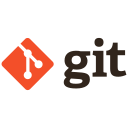

<a href="https://mkabumattar.com/" target="_blank">
<picture>
  <source media="(prefers-color-scheme: dark)" srcset="./.github/assets/img/banner-dark.svg" />
  
</picture>
</a>

# Mohammad Abu Mattar

**AWS-Certified DevOps Engineer** · Cloud, Platform & Reliability · Amman, Jordan

---

I'm a DevOps engineer with 6+ years building high-scale cloud automation and fintech infrastructure. I govern multi-account AWS environments, run production microservices on Kubernetes and ECS, and treat everything as code — with a deep focus on PCI-DSS compliance and supply-chain security. Alongside client work, I build and maintain open-source developer tools.

## Featured Projects

| Project | Description | Links |
| --- | --- | --- |
| **QuenchWorks** | Security-first replacement for the Bitnami catalog — 0-CVE hardened container images and Helm charts, built from source on Wolfi, signed and pinned by digest. | [Site](https://quench-works.com/) · [GitHub](https://github.com/quenchworks) |
| **Rawi** | AI-powered CLI that auto-generates documentation for command-line applications. | [Docs](https://rawi.mkabumattar.com/) · [npm](https://www.npmjs.com/package/rawi) |
| **NetCalc Pro** | Zero-backend suite for subnetting, CIDR & VLSM with shareable state and IaC export. | [Live](https://netcalc-pro.mkabumattar.com/) |
| **Devicons React** | Programming-language & tooling icons as React components — 5k+ weekly npm downloads. | [Docs](https://devicons-react.mkabumattar.com/) · [npm](https://www.npmjs.com/package/devicons-react) |
| **AWS Icons** | Complete, free SVG library of every AWS service icon, via CDN or npm. | [Docs](https://aws-icon.mkabumattar.com/icons) · [npm](https://www.npmjs.com/package/aws-icons) |

<a href="https://mkabumattar.com/#projects">See all projects →</a>

## Tech Stack

  <picture><source media="(prefers-color-scheme: dark)" srcset="./assets/aws-dark.svg"/></picture>&nbsp;&nbsp;
  <picture><source media="(prefers-color-scheme: dark)" srcset="./assets/terraform-dark.svg"/></picture>&nbsp;&nbsp;
  <picture><source media="(prefers-color-scheme: dark)" srcset="./assets/ansible-dark.svg"/></picture>&nbsp;&nbsp;
  <picture><source media="(prefers-color-scheme: dark)" srcset="./assets/docker-dark.svg"/></picture>&nbsp;&nbsp;
  <picture><source media="(prefers-color-scheme: dark)" srcset="./assets/jenkins-dark.svg"/></picture>&nbsp;&nbsp;
  &nbsp;&nbsp;
  &nbsp;&nbsp;
  <picture><source media="(prefers-color-scheme: dark)" srcset="./assets/bash-dark.svg"/></picture>&nbsp;&nbsp;
  &nbsp;&nbsp;
  &nbsp;&nbsp;
  <picture><source media="(prefers-color-scheme: dark)" srcset="./assets/nodejs-dark.svg"/></picture>&nbsp;&nbsp;
  &nbsp;&nbsp;
  <picture><source media="(prefers-color-scheme: dark)" srcset="./assets/postgresql-dark.svg"/></picture>&nbsp;&nbsp;
  <picture><source media="(prefers-color-scheme: dark)" srcset="./assets/redis-dark.svg"/></picture>&nbsp;&nbsp;
  <picture><source media="(prefers-color-scheme: dark)" srcset="./assets/git-dark.svg"/></picture>

## Latest Blog Posts

<!-- BLOG-POST-LIST:START -->
- [[Blog] FinOps in Practice: How to Build a Cloud Cost Accountability Culture on AWS](https://mkabumattar.com/blog/post/finops-cloud-cost-accountability-aws/)
- [[Blog] QuenchWorks: A Zero-CVE, Built-From-Source Replacement for the Bitnami Catalog](https://mkabumattar.com/blog/post/quenchworks-zero-cve-bitnami-alternative-wolfi/)
- [[Blog] Dotfiles: A Git-Based Strategy for Configuration Management](https://mkabumattar.com/blog/post/dotfiles/)
- [[Blog] Setting up Node JS, Express, MongoDB, Prettier, ESLint and Husky Application with Babel and authentication as an example](https://mkabumattar.com/blog/post/setting-up-node-js-express-mongodb-prettier-eslint-and-husky-application-with-babel-and-authentication-as-an-example/)
- [[Blog] Git SSH Keys for GitHub, GitLab, and Bitbucket on Linux](https://mkabumattar.com/blog/post/git-ssh-keys-for-github-gitlab-and-bitbucket-on-linux/)
- [[Blog] Git SSH Keys for GitHub, GitLab, and Bitbucket on Windows](https://mkabumattar.com/blog/post/git-ssh-keys-for-github-gitlab-and-bitbucket-on-windows/)
- [[Blog] AI is Not Real: A Software Engineering Perspective](https://mkabumattar.com/blog/post/ai-is-not-real/)
- [[DevTips] Kubernetes Namespaces: Organize, Isolate, and Secure Multi-Team Clusters](https://mkabumattar.com/devtips/post/kubernetes-namespaces-organize-isolate-multi-team/)
<!-- BLOG-POST-LIST:END -->

<a href="https://mkabumattar.com/blog">Read more →</a>

---

Made with ☕ by <a href="https://mkabumattar.com/">Mohammad Abu Mattar</a>

