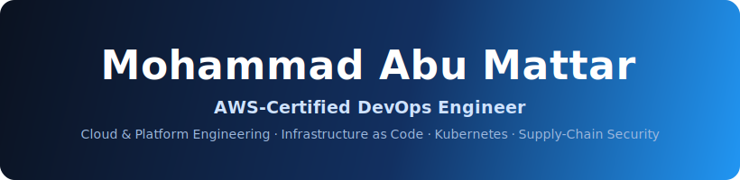

<div align="center">
<a href="https://mkabumattar.github.io/" target="_blank">

</a>
</div>

<h1 align="center">👋 Hello, I'm Mohammad Abu Mattar</h1>

<p align="center">
  
</p>

<p align="center">
  <a href="https://mkabumattar.com/">
    
  </a>
  <a href="https://mkabumattar.com/blog">
    
  </a>
  <a href="https://mkabumattar.com/devtips/">
    
  </a>
  <a href="https://mkabumattar.com/codesnippets/">
    
  </a>
  <a href="https://linktree.mkabumattar.com/">
    
  </a>
  <a href="mailto:info@mkabumattar.com">
    
  </a>
  <a href="https://mkabumattar.com/assets/pdf/mohammad_abu_mattar_cv.pdf">
    
  </a>
</p>

---

## 🚀 About Me

```python
from typing import TypedDict

class DevOpsProfile(TypedDict):
    title: str
    experience: str
    location: str
    specialization: list[str]
    expertise: list[str]
    currentlyLearning: str
    interests: list[str]
    askMeAbout: list[str]
    funFact: str

mohammad: DevOpsProfile = {
    "title": "AWS-Certified DevOps Engineer",
    "experience": "6+ years",
    "location": "🌍 Amman, Jordan",
    "specialization": [
        "High-Scale Cloud Automation",
        "Fintech Infrastructure",
        "Multi-Account AWS Governance",
        "Production Microservices Orchestration"
    ],
    "expertise": [
        "Infrastructure as Code (Terraform, Terragrunt, CloudFormation)",
        "PCI-DSS Compliance & Security",
        "CI/CD & GitOps",
        "Container Orchestration (Kubernetes, ECS)",
        "Operational Excellence"
    ],
    "currentlyLearning": "Serverless Architecture & Advanced Security Patterns",
    "interests": ["AI & Machine Learning", "RAG (Retrieval-Augmented Generation)", "GraphRAG"],
    "askMeAbout": ["AWS", "DevOps", "Fintech", "Microservices", "IaC", "Security"],
    "funFact": "I believe AI is not real... yet! 🤖"
}
```

🔭 **AWS-Certified DevOps Engineer** with **6+ years** specializing in high-scale cloud automation and fintech infrastructure  
☁️ Expert in governing **multi-account AWS environments**, orchestrating **production microservices**, and implementing **Infrastructure as Code**  
🔒 Deep focus on **PCI-DSS compliance**, **security**, and **operational excellence**  
💡 I love sharing knowledge through my [blog](https://mkabumattar.com/blog) and contributing to open-source projects  
📚 Always learning and staying up-to-date with the latest cloud technologies and security best practices  
⚡ When I'm not engineering infrastructure, you'll find me writing technical articles or experimenting with new AWS services

## 📝 Latest Blog Posts

> Check out my latest thoughts and tutorials on DevOps engineering, cloud technologies, and best practices.

<!-- BLOG-POST-LIST:START -->
- [[Quizzes] Responsive Web Design: Mobile-First &amp; Breakpoints](https://mkabumattar.com/quizzes/post/responsive-design-quiz/)
- [[Blog] Edge Computing: AWS Lambda@Edge vs. Cloudflare Workers – A Practical Guide](https://mkabumattar.com/blog/post/edge-computing-aws-lambda-at-edge-vs-cloudflare-workers-practical-guide/)
- [[Quizzes] Advanced API Architecture &amp; Design Patterns](https://mkabumattar.com/quizzes/post/advanced-api-architecture-quiz/)
- [[Quizzes] Infrastructure Patterns: IaC, Provisioning &amp; Orchestration](https://mkabumattar.com/quizzes/post/infrastructure-patterns-quiz/)
- [[Slides] Observability Engineering: From Metrics to Insights](https://mkabumattar.com/slides/post/observability-engineering-from-metrics-to-insights/)
- [[Quizzes] Node.js &amp; Express Fundamentals: Building Server Applications](https://mkabumattar.com/quizzes/post/nodejs-express-fundamentals-quiz/)
- [[Quizzes] React Fundamentals: Components, Hooks &amp; State Management](https://mkabumattar.com/quizzes/post/react-fundamentals-quiz/)
- [[Code Snippet] Multi-Environment Secret Management with HashiCorp Vault](https://mkabumattar.com/codesnippets/post/hashicorp-vault-multi-environment-secrets/)
<!-- BLOG-POST-LIST:END -->

<p align="right"><a href="https://mkabumattar.com/blog">📖 Read more articles →</a></p>

---

<div align="center">
  <sub>Made With ❤ &amp; a lot ☕ By <a href="https://mkabumattar.com/">Mohammad Abu Mattar</a></sub>
</div>
