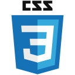
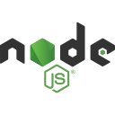

<div align="center">
<a href="https://mkabumattar.github.io/" target="_blank">

</a>
</div>

<h1 align="center">👋 Hello, I'm Mohammad Abu Mattar</h1>

<p align="center">
  
</p>

<p align="center">
  <a href="https://mkabumattar.com/">
    
  </a>
  <a href="https://mkabumattar.com/blog">
    
  </a>
  <a href="mailto:info@mkabumattar.com">
    
  </a>
  <a href="https://mkabumattar.com/assets/pdf/mohammad_abu_mattar_cv.pdf">
    
  </a>
</p>

---

## 🚀 About Me

```typescript
const mohammad = {
    title: "DevOps Engineer",
    location: "🌍 Amman, Jordan",
    focus: ["DevOps", "Cloud Technologies", "AWS", "Full-Stack Development"],
    currentlyLearning: "Serverless Architecture & Microservices",
    askMeAbout: ["AWS", "React", "Node.js", "Python", "DevOps", "System Design"],
    funFact: "I believe AI is not real... yet! 🤖"
};
```

🔭 I'm a passionate **DevOps Engineer** specializing in **cloud technologies** with a strong focus on **AWS**  
🌱 Currently exploring **serverless architectures** and **modern DevOps practices**  
💡 I love sharing knowledge through my [blog](https://mkabumattar.com/blog) and contributing to open-source projects  
📚 Always learning and staying up-to-date with the latest tech trends  
⚡ When I'm not coding, you'll find me writing technical articles or experimenting with new technologies

## 📝 Latest Blog Posts

> Check out my latest thoughts and tutorials on DevOps engineering, cloud technologies, and best practices.

<!-- BLOG-POST-LIST:START -->
- [Check S3 Bucket Existence](https://mkabumattar.com/codesnippets/post/bash-s3-bucket-exists/)
- [Securing CI/CD with IAM Roles](https://mkabumattar.com/devtips/post/securing-cicd-with-iam-roles/)
- [Centralized Logging with Loki, Grafana, and Fluent Bit: Making Sense of Your Systems](https://mkabumattar.com/blog/post/centralized-logging-loki-grafana-fluent-bit/)
- [Karpenter vs. Cluster Autoscaler on AWS: Picking the Right Tool for Your Kubernetes Scaling](https://mkabumattar.com/blog/post/karpenter-vs-cluster-autoscaler-aws-kubernetes-scaling/)
- [Unlocking the Secrets: HashiCorp Vault vs. AWS Secrets Manager vs. SOPS - Which Reigns Supreme](https://mkabumattar.com/blog/post/secrets-management-vault-secrets-manager-sops/)
- [The AI Revolution in DevOps: How Smart Tech is Changing Incident Response](https://mkabumattar.com/blog/post/ai-powered-devops-incident-response-llms/)
- [Platform Engineering: Building Internal Developer Platforms &lpar;IDPs&rpar;](https://mkabumattar.com/blog/post/platform-engineering-building-internal-developer-platforms/)
- [The Real Talk on Microservices vs. Monoliths](https://mkabumattar.com/blog/post/0076-the-dark-side-of-microservices-when-to-avoid-them/)
<!-- BLOG-POST-LIST:END -->

<p align="right"><a href="https://mkabumattar.com/blog">📖 Read more articles →</a></p>

## 🌐 Connect with Me

<div align="center">
  <a href="https://linkedin.com/in/mkabumattar" target="_blank">
    
  </a>
  <a href="https://twitter.com/mkabumattar" target="_blank">
    
  </a>
  <a href="https://instagram.com/mkabumattar" target="_blank">
    
  </a>
  <a href="https://codepen.io/mkabumattar" target="_blank">
    
  </a>
  <a href="https://mkabumattar.com/rss.xml" target="_blank">
    
  </a>
</div>


## 🛠️ Tech Stack & Skills


<h3 align="left">Programming Languages:</h3>

<div align="left">
  <picture>
    <source media="(prefers-color-scheme: dark)" srcset="./assets/java.svg">
    
  </picture>
  <picture>
    <source media="(prefers-color-scheme: dark)" srcset="./assets/javascript.svg">
    
  </picture>
  <picture>
    <source media="(prefers-color-scheme: dark)" srcset="./assets/python.svg">
    
  </picture>
  <picture>
    <source media="(prefers-color-scheme: dark)" srcset="./assets/typescript.svg">
    
  </picture>
</div>

<h3 align="left">Web Development</h3>

<h4 align="left">Frontend:</h4>

<div align="left">
  <picture>
    <source media="(prefers-color-scheme: dark)" srcset="./assets/css3-dark.svg">
    
  </picture>
  <picture>
    <source media="(prefers-color-scheme: dark)" srcset="./assets/html5-dark.svg">
    
  </picture>
  <picture>
    <source media="(prefers-color-scheme: dark)" srcset="./assets/sass.svg">
    
  </picture>
  <picture>
    <source media="(prefers-color-scheme: dark)" srcset="./assets/tailwindcss-dark.svg">
    
  </picture>
</div>

<h4 align="left">Backend:</h4>

<div align="left">
  <picture>
    <source media="(prefers-color-scheme: dark)" srcset="./assets/nodejs-dark.svg">
    
  </picture>
  <picture>
    <source media="(prefers-color-scheme: dark)" srcset="./assets/express-dark.svg">
    
  </picture>
  <picture>
    <source media="(prefers-color-scheme: dark)" srcset="./assets/fastapi.svg">
    
  </picture>
  <picture>
    <source media="(prefers-color-scheme: dark)" srcset="./assets/spring.svg">
    
  </picture>
</div>

<h4 align="left">Frameworks & Libraries:</h4>

<div align="left">
  <picture>
    <source media="(prefers-color-scheme: dark)" srcset="./assets/astro-dark.svg">
    
  </picture>
  <picture>
    <source media="(prefers-color-scheme: dark)" srcset="./assets/nextjs-dark.svg">
    
  </picture>
  <picture>
    <source media="(prefers-color-scheme: dark)" srcset="./assets/react.svg">
    
  </picture>
</div>

<h3 align="left">Database:</h3>

<div align="left">
  <picture>
    <source media="(prefers-color-scheme: dark)" srcset="./assets/dynamodb.svg">
    
  </picture>
  <picture>
    <source media="(prefers-color-scheme: dark)" srcset="./assets/mariadb-dark.svg">
    
  </picture>
  <picture>
    <source media="(prefers-color-scheme: dark)" srcset="./assets/mongodb-dark.svg">
    
  </picture>
  <picture>
    <source media="(prefers-color-scheme: dark)" srcset="./assets/mysql-dark.svg">
    
  </picture>
  <picture>
    <source media="(prefers-color-scheme: dark)" srcset="./assets/postgresql-dark.svg">
    
  </picture>
  <picture>
    <source media="(prefers-color-scheme: dark)" srcset="./assets/redis-dark.svg">
    
  </picture>
</div>

<h3 align="left">Cloud & DevOps:</h3>

<div align="left">
  <picture>
    <source media="(prefers-color-scheme: dark)" srcset="./assets/aws-dark.svg">
    
  </picture>
  <picture>
    <source media="(prefers-color-scheme: dark)" srcset="./assets/ansible-dark.svg">
    
  </picture>
  <picture>
    <source media="(prefers-color-scheme: dark)" srcset="./assets/docker-dark.svg">
    
  </picture>
  <picture>
    <source media="(prefers-color-scheme: dark)" srcset="./assets/jenkins-dark.svg">
    
  </picture>
  <picture>
    <source media="(prefers-color-scheme: dark)" srcset="./assets/terraform-dark.svg">
    
  </picture>
  <picture>
    <source media="(prefers-color-scheme: dark)" srcset="./assets/terragrunt-dark.svg">
    
  </picture>
</div>

<h3 align="left">Version Control:</h3>

<div align="left">
  <picture>
    <source media="(prefers-color-scheme: dark)" srcset="./assets/git-dark.svg">
    
  </picture>
  <picture>
    <source media="(prefers-color-scheme: dark)" srcset="./assets/bitbucket-dark.svg">
    
  </picture>
  <picture>
    <source media="(prefers-color-scheme: dark)" srcset="./assets/github-dark.svg">
    
  </picture>
  <picture>
    <source media="(prefers-color-scheme: dark)" srcset="./assets/gitlab-dark.svg">
    
  </picture>
</div>

<h3 align="left">Servers:</h3>

<div align="left">
  <picture>
    <source media="(prefers-color-scheme: dark)" srcset="./assets/apache.svg">
    
  </picture>
  <picture>
    <source media="(prefers-color-scheme: dark)" srcset="./assets/nginx.svg">
    
  </picture>
</div>

<h3 align="left">Tools:</h3>

<div align="left">
  <picture>
    <source media="(prefers-color-scheme: dark)" srcset="./assets/bash-dark.svg">
    
  </picture>
  <picture>
    <source media="(prefers-color-scheme: dark)" srcset="./assets/jetbrains.svg">
    
  </picture>
  <picture>
    <source media="(prefers-color-scheme: dark)" srcset="./assets/npm.svg">
    
  </picture>
  <picture>
    <source media="(prefers-color-scheme: dark)" srcset="./assets/pnpm-dark.svg">
    
  </picture>
  <picture>
    <source media="(prefers-color-scheme: dark)" srcset="./assets/poetry.svg">
    
  </picture>
  <picture>
    <source media="(prefers-color-scheme: dark)" srcset="./assets/postman.svg">
    
  </picture>
  <picture>
    <source media="(prefers-color-scheme: dark)" srcset="./assets/powershell.svg">
    
  </picture>
  <picture>
    <source media="(prefers-color-scheme: dark)" srcset="./assets/ssh-dark.svg">
    
  </picture>
  <picture>
    <source media="(prefers-color-scheme: dark)" srcset="./assets/swagger-dark.svg">
    
  </picture>
  <picture>
    <source media="(prefers-color-scheme: dark)" srcset="./assets/vim.svg">
    
  </picture>
  <picture>
    <source media="(prefers-color-scheme: dark)" srcset="./assets/vscode.svg">
    
  </picture>
  <picture>
    <source media="(prefers-color-scheme: dark)" srcset="./assets/yarn.svg">
    
  </picture>
</div>

<h3 align="left">Operating System:</h3>

<div align="left">
  <picture>
    <source media="(prefers-color-scheme: dark)" srcset="./assets/linux.svg">
    
  </picture>
  <picture>
    <source media="(prefers-color-scheme: dark)" srcset="./assets/debian-dark.svg">
    
  </picture>
  <picture>
    <source media="(prefers-color-scheme: dark)" srcset="./assets/ubuntu-dark.svg">
    
  </picture>
  <picture>
    <source media="(prefers-color-scheme: dark)" srcset="./assets/windows.svg">
    
  </picture>
</div>

## 🏆 Certifications & Achievements

<div align="center">
  <picture>
    <source media="(prefers-color-scheme: dark)" srcset="./assets/aws-certified-developer-associate.png">
    
  </picture>
  <picture>
    <source media="(prefers-color-scheme: dark)" srcset="./assets/aws-certified-cloud-practitioner.png">
    
  </picture>
</div>

<div align="center">
  <a href="https://www.credly.com/users/mkabumattar/badges" target="_blank">
    
  </a>
</div>

## 📊 GitHub Analytics

<div align="center">
  <picture>
    <source media="(prefers-color-scheme: dark)" srcset="https://github-readme-streak-stats.herokuapp.com/?user=mkabumattar&theme=radical">
    
  </picture>
</div>

<div align="center">
  <picture>
    <source media="(prefers-color-scheme: dark)" srcset="https://github-readme-stats.vercel.app/api?username=mkabumattar&show_icons=true&locale=en&theme=radical">
    
  </picture>
</div>


<div align="center">
  <picture>
    <source media="(prefers-color-scheme: dark)" srcset="https://github-readme-stats.vercel.app/api/top-langs?username=mkabumattar&show_icons=true&locale=en&layout=compact&theme=radical">
    
  </picture>
</div>

## 💡 Random Dev Quote

<div align="center">
  
</div>

---

## 🔥 Recent Activity

<!--START_SECTION:activity-->
1. 🎉 Merged PR [#64](https://github.com/MKAbuMattar/witsy-chocolatey-package/pull/64) in [MKAbuMattar/witsy-chocolatey-package](https://github.com/MKAbuMattar/witsy-chocolatey-package)
<!--END_SECTION:activity-->

## 💭 Philosophy

> The best way to predict the future is to create it.
>
> Peter Drucker

I believe in continuous learning, clean code, and building solutions that make a difference. My passion lies in leveraging cloud technologies to create scalable, efficient, and innovative software solutions.

---

<div align="center">
  
  
</div>

<div align="center">
  <h3>🤝 Let's Connect and Build Something Amazing Together!</h3>
  <p>
    <em>Feel free to reach out if you want to collaborate on projects, discuss technology, or just have a friendly chat about software engineering!</em>
  </p>
</div>

---

<div align="center">
  <sub>Made With ❤ &amp; a lot ☕ By <a href="https://mkabumattar.com/">Mohammad Abu Mattar</a></sub>
</div>